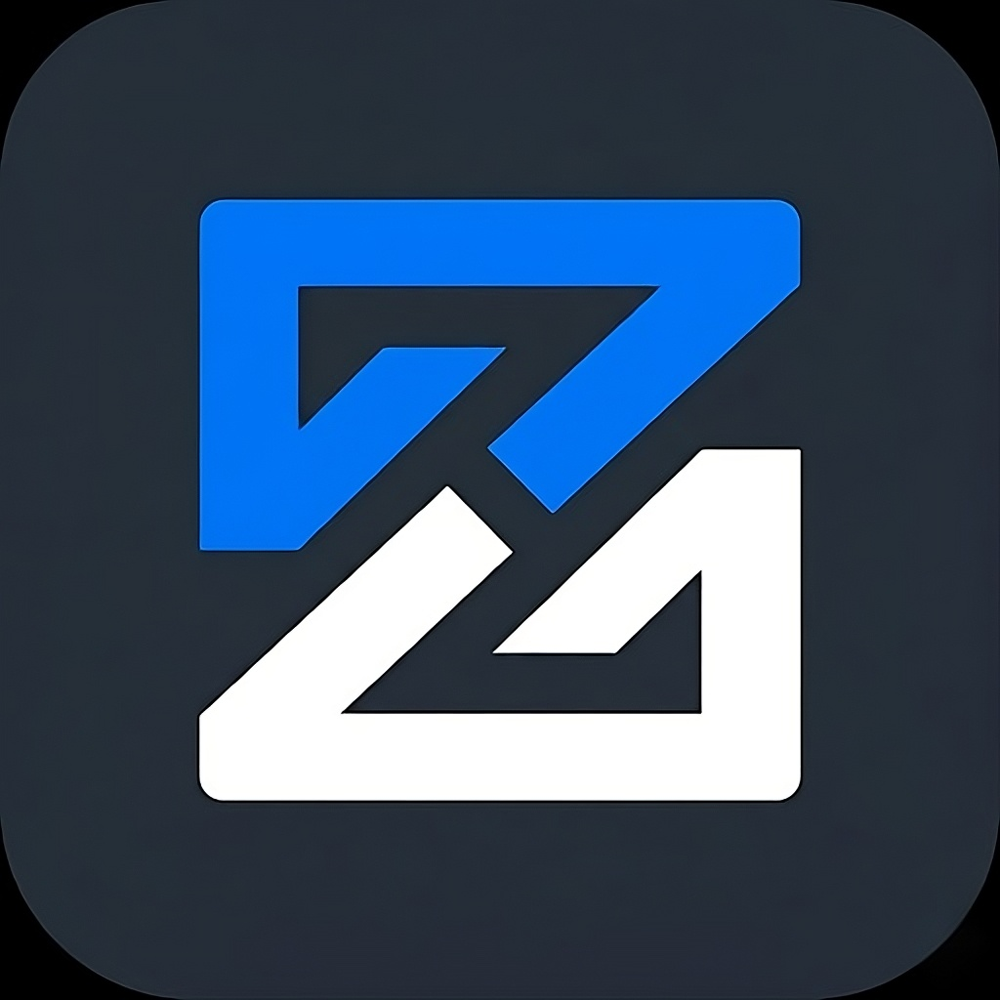

# ZYNC — Real-Time Team Collaboration Platform

<p align="center">
  
</p>

<p align="center">
  <strong>AI-powered project management and real-time collaboration for modern development teams.</strong>
</p>

<p align="center">
  <a href="https://zync.io" target="_blank">Live Demo</a> &bull;
  <a href="#features">Features</a> &bull;
  <a href="#tech-stack">Tech Stack</a> &bull;
  <a href="#getting-started">Getting Started</a> &bull;
  <a href="#architecture">Architecture</a> &bull;
  <a href="#contributing">Contributing</a>
</p>

---

## Overview

ZYNC is a full-stack **real-time collaboration platform** built for development teams who need project management, collaborative editing, instant messaging, and code integration in one unified workspace. The platform combines an AI-powered project architect, CRDT-based collaborative note editing, real-time chat with delivery receipts, and deep GitHub integration.

### What makes ZYNC different?

| Feature | How It Works |
|---------|--------------|
| **AI Project Architect** | Describe your project and let AI generate the full architecture, tech stack recommendations, and step-by-step implementation plan using Google Gemini & Groq |
| **Real-Time Note Collaboration** | Conflict-free editing powered by Yjs CRDT with live cursors, presence indicators, and block-based editor (BlockNote) |
| **Kanban + Git Sync** | Drag-and-drop task board that links tasks to GitHub commits, branches, and pull requests |
| **Real-Time Chat** | Socket.IO-powered messaging with typing indicators, read receipts, file sharing, and project invites |
| **Design Inspiration** | Browse and search Dribbble/Behance designs with live scraping and Redis caching |
| **Activity Intelligence** | Session tracking with contribution graphs, activity logs, and time analytics |

---

## Features

### Project Management

| Feature | Description |
|---------|-------------|
| **Dashboard** | Centralized overview of team activity, recent projects, and quick actions |
| **Workspace** | Kanban-style project boards with drag-and-drop task management (via DnD Kit) |
| **AI Architecture** | Generate full project architecture with step breakdowns using AI |
| **Task Management** | Create, assign, and track tasks with priorities, due dates, and status transitions |
| **Project Search** | Search across all projects with intelligent filtering |

### Real-Time Collaboration

| Feature | Description |
|---------|-------------|
| **Collaborative Notes** | Real-time block-editor with Yjs CRDT — multiple users edit simultaneously with live cursors |
| **Live Presence** | See who's online, their cursor position, and active document in real-time |
| **Instant Chat** | Direct messaging with typing indicators, read receipts, and delivery confirmation |
| **File Sharing** | Share files in chat with upload support and preview |
| **Project Invites** | Send and receive project invitations through the chat system |

### Development Integration

| Feature | Description |
|---------|-------------|
| **GitHub OAuth** | Connect your GitHub account for repository access |
| **Repository Linking** | Link GitHub repos to projects and auto-track commits |
| **Task-Git Sync** | Associate tasks with commits, branches, and pull requests |
| **GitHub App** | Webhook integration for real-time repository events |
| **Git Commands** | Built-in Git command reference and quick actions |

### Team & Communication

| Feature | Description |
|---------|-------------|
| **Teams** | Create teams with invite codes, member management, and role-based access |
| **Calendar** | Team calendar with multi-country holiday support and deadline tracking |
| **Meetings** | Schedule meetings with auto-generated Google Meet links |
| **Activity Log** | Detailed activity tracking with time logging and contribution graphs |
| **People** | Browse team members, manage connections, and view profiles |

### Additional Features

| Feature | Description |
|---------|-------------|
| **Design Inspiration** | Search Dribbble and Behance with live scraping and cached results |
| **LinkedIn Login** | OAuth-based LinkedIn authentication |
| **Dark/Light Theme** | System-aware theme with class-based dark mode |
| **Offline Support** | TanStack Query persistence (7-day cache) with Dexie IndexedDB storage |
| **Landing Page** | Polished marketing page with hero, features, testimonials, and CTAs |

---

## Tech Stack

### Frontend

| Technology | Purpose |
|------------|---------|
| **React 18** | UI component library |
| **TypeScript** | Type-safe JavaScript |
| **Vite** | Build tool and dev server |
| **Tailwind CSS 4** | Utility-first CSS framework |
| **Shadcn/UI + Radix UI** | 54 accessible UI components |
| **Mantine** | Additional UI components and hooks |
| **TanStack Query** | Server state management with persistence |
| **BlockNote** | Block-based rich text editor |
| **Yjs** | CRDT for real-time collaborative editing |
| **Socket.IO Client** | Real-time bidirectional communication |
| **Framer Motion** | Animations and transitions |
| **DnD Kit** | Drag-and-drop for Kanban boards |
| **Recharts + Chart.js** | Data visualization |
| **Firebase Auth** | Authentication with App Check (reCAPTCHA v3) |
| **Lucide React** | Icon library |

### Backend

| Technology | Purpose |
|------------|---------|
| **Express 5** | Web framework |
| **Socket.IO** | WebSocket server with 4 namespaces (chat, notes, presence, tasks) |
| **Prisma** | ORM for MongoDB (schema: 11 models) |
| **Mongoose** | MongoDB ODM (legacy models) |
| **MongoDB** | Primary database (Oracle Autonomous Database) |
| **Redis** | Caching layer for design inspiration |
| **Cloudinary** | Image storage (profile photos, file uploads) |
| **Firebase Admin** | Server-side Firebase operations |
| **Google Gemini + Groq** | AI-powered project architecture generation |
| **Octokit** | GitHub API integration |
| **Google Meet API** | Meeting link generation |
| **Puppeteer** | Web scraping (Dribbble, Behance, LinkedIn) |
| **Nodemailer** | Transactional emails via Gmail API |
| **Helmet + CORS + Rate Limiting** | Security middleware |
| **Zod** | Request validation |

### Infrastructure

| Component | Details |
|-----------|---------|
| **Frontend Hosting** | Vercel (SPA with immutable asset caching) |
| **Backend Hosting** | Oracle Cloud VM (Ubuntu 24.04, PM2 process manager) |
| **Database** | Oracle Autonomous Database (MongoDB-compatible) |
| **CI/CD** | GitHub Actions (lint, type-check, test, build) |
| **Deployment** | `deploy.sh` script — rsync to Oracle VM + PM2 restart |

## System Requirements

### Minimum Requirements

<!--
  These are the minimum system requirements needed to run the ZYNC desktop
  application. The application may run on systems below these specifications
  but performance may be degraded.
-->

| Component | Requirement |
|-----------|-------------|
| **CPU** | 1.6 GHz dual-core processor |
| **RAM** | 2 GB |
| **Storage** | 500 MB available disk space |
| **Display** | 1280 x 720 resolution |
| **Network** | Broadband internet connection (for real-time features) |

### Recommended Specifications

<!--
  These specifications provide the best experience when using the ZYNC
  desktop application, especially when using resource-intensive features
  like video conferencing and collaborative editing.
-->

| Component | Specification |
|-----------|---------------|
| **CPU** | 2.0 GHz quad-core processor or better |
| **RAM** | 4 GB or more |
| **Storage** | 1 GB available disk space |
| **Display** | 1920 x 1080 resolution or higher |
| **Network** | High-speed internet connection (10 Mbps+) |
| **Camera** | Webcam (for video conferencing features) |
| **Microphone** | Built-in or external microphone (for audio features) |

### Supported Operating Systems

<!--
  The following operating systems are officially supported and tested.
  The application may work on other versions but is not guaranteed to
  function correctly. Each platform has specific build targets and
  installer formats.
-->

| Platform | Versions | Architecture | Installer |
|----------|----------|-------------|-----------|
| **Windows** | Windows 10, Windows 11 | x64, arm64 | NSIS (.exe) |
| **macOS** | macOS 10.15 (Catalina) and later | x64, arm64 (Apple Silicon) | DMG (.dmg) |
| **Linux** | Ubuntu 18.04+, Fedora 32+, Debian 10+ | x64 | AppImage (.AppImage) |

---

## Installation

### Download Pre-built Binaries

<!--
  Pre-built binaries are the easiest way to install ZYNC. They are
  available for all supported platforms from the GitHub Releases page.
  Each release includes checksums for verifying download integrity.
-->

Visit the [Releases](https://github.com/ChitkulLakshya/Zync/releases) page to
download the latest version for your platform.

### Windows Installation

<!--
  The Windows installer uses NSIS (Nullsoft Scriptable Install System) to
  provide a familiar installation experience. Users can choose the
  installation directory and whether to create desktop/start menu shortcuts.
-->

1. Download `ZYNC-Setup-x.x.x.exe` from the Releases page
2. Run the installer
3. Choose the installation directory (default: `C:\Program Files\ZYNC`)
4. Select whether to create desktop and Start Menu shortcuts
5. Click "Install" to complete the installation
6. Launch ZYNC from the desktop shortcut or Start Menu

**Silent Installation (for system administrators):**
```powershell
# Install silently with default options
ZYNC-Setup-x.x.x.exe /S

# Install to a custom directory
ZYNC-Setup-x.x.x.exe /S /D=C:\CustomPath\ZYNC
```

### macOS Installation

<!--
  The macOS installer uses a DMG (Disk Image) format, which is the standard
  installation method on macOS. Users simply drag the application to the
  Applications folder.
-->

1. Download `ZYNC-x.x.x.dmg` from the Releases page
2. Open the DMG file
3. Drag `ZYNC.app` to the `Applications` folder
4. Launch ZYNC from the Applications folder or Spotlight search
5. If prompted about the application being from an unidentified developer:
   - Go to System Preferences → Security & Privacy
   - Click "Open Anyway"

**Installation via Homebrew (coming soon):**
```bash
# Install via Homebrew Cask
brew install --cask zync
```

### Linux Installation

<!--
  The Linux build uses AppImage format, which is a portable application
  format that works on most Linux distributions without requiring
  installation. Simply make the file executable and run it.
-->

1. Download `ZYNC-x.x.x.AppImage` from the Releases page
2. Make the file executable:
   ```bash
   chmod +x ZYNC-x.x.x.AppImage
   ```
3. Run the application:
   ```bash
   ./ZYNC-x.x.x.AppImage
   ```

**Desktop Integration:**
```bash
# Install AppImageLauncher for desktop integration
# Then double-click the AppImage to integrate it into your desktop
sudo apt install appimagelauncher
```

---

## Development

### Prerequisites

<!--
  Before setting up the development environment, ensure you have the
  following tools installed on your system. These are required for
  building and running the ZYNC desktop application from source.
-->

| Tool | Version | Purpose |
|------|---------|---------|
| **Node.js** | 18.x or later | JavaScript runtime for building and running |
| **npm** | 9.x or later | Package manager for installing dependencies |
| **Git** | 2.x or later | Version control for source code management |
| **Python** | 3.x | Required by some native Node.js modules |
| **Visual Studio Build Tools** | 2019+ (Windows only) | Required for compiling native modules on Windows |
| **Xcode Command Line Tools** | (macOS only) | Required for compiling native modules on macOS |

### Setting Up the Development Environment

<!--
  Follow these steps to set up a local development environment for the
  ZYNC desktop application. This will allow you to make changes to the
  source code and test them locally before submitting a pull request.
-->

```bash
# Step 1: Clone the repository from GitHub
# This creates a local copy of the source code on your machine
git clone https://github.com/ChitkulLakshya/Zync.git

# Step 2: Navigate into the project directory
# All subsequent commands should be run from this directory
cd Zync

# Step 3: Install all project dependencies
# This installs both production and development dependencies
# defined in package.json. The installation may take several
# minutes depending on your internet connection speed.
npm install

# Step 4: Create a local environment file
# Copy the example environment file and fill in your own values
# for the Firebase configuration and API URLs
cp .env.example .env

# Step 5: Verify the installation
# Run the TypeScript compiler to check for any type errors
npx tsc --noEmit
```

### Running in Development Mode

<!--
  Development mode starts the Vite development server for the frontend
  and the Electron application simultaneously. Changes to the frontend
  code will be hot-reloaded automatically, while changes to the Electron
  main process code will require a restart.
-->

```bash
# Start the application in development mode
# This runs both the Vite dev server and Electron concurrently
npm run electron:dev

# Alternatively, run just the web application without Electron
# Useful for frontend development and testing
npm run dev

# Run with verbose logging enabled
# This provides detailed output for debugging purposes
ELECTRON_ENABLE_LOGGING=1 npm run electron:dev
```

### Project Structure

<!--
  The following directory structure shows the organization of the ZYNC
  project. Each directory serves a specific purpose in the application
  architecture. Understanding this structure is essential for contributing
  to the project.
-->

```
Zync/
├── .github/                    # GitHub-specific configuration files
│   ├── workflows/              # GitHub Actions CI/CD workflows
│   │   ├── electron-build.yml  # Automated build pipeline for all platforms
│   │   ├── release.yml         # Automated release pipeline
│   │   └── codeql.yml          # Security analysis workflow
│   └── dependabot.yml          # Automated dependency update configuration
│
├── build/                      # Build resources for electron-builder
│   └── icons/                  # Application icons for all platforms
│       ├── icon.ico            # Windows icon (256x256, multi-size ICO)
│       ├── icon.icns           # macOS icon (512x512, Apple Icon format)
│       └── icon.png            # Linux icon (512x512, PNG format)
│
├── docs/                       # Developer documentation
│   ├── architecture/ARCHITECTURE.md # System architecture documentation
│   ├── DEVELOPMENT.md          # Development setup guide
│   └── DEPLOYMENT.md           # Deployment and release guide
│
├── electron/                   # Electron main process source code
│   ├── assets/                 # Static assets for the Electron app
│   │   ├── icons.ts            # Base64-encoded SVG icons
│   │   ├── platform-logos.ts   # Base64-encoded platform logos
│   │   ├── sounds.ts           # Base64-encoded notification sounds
│   │   └── splash.ts           # Splash screen resources
│   │
│   ├── config/                 # Configuration modules
│   │   ├── constants.ts        # Application-wide constants
│   │   ├── csp.ts              # Content Security Policy configuration
│   │   ├── defaults.ts         # Default configuration values
│   │   ├── permissions.ts      # Permission handler configuration
│   │   └── security.ts         # Security policy configuration
│   │
│   ├── interfaces/             # TypeScript interface definitions
│   │   ├── config.ts           # Configuration interfaces
│   │   ├── ipc.ts              # IPC message interfaces
│   │   ├── services.ts         # Service interfaces
│   │   ├── settings.ts         # Settings interfaces
│   │   ├── updater.ts          # Auto-updater interfaces
│   │   └── window.ts           # Window management interfaces
│   │
│   ├── main/                   # Main process modules
│   │   ├── crash-reporter.ts   # Crash reporting service
│   │   ├── deep-link.ts        # Deep linking handler
│   │   ├── ipc-handlers.ts     # IPC event handlers
│   │   ├── menu.ts             # Application menu builder
│   │   ├── tray.ts             # System tray manager
│   │   └── window-state.ts     # Window state persistence
│   │
│   ├── preload/                # Preload script modules
│   │   └── types.d.ts          # Type definitions for exposed APIs
│   │
│   ├── renderer/               # Renderer process helpers
│   │
│   ├── services/               # Background services
│   │   └── auto-updater.ts     # Auto-update service
│   │
│   ├── settings/               # Settings window
│   │   ├── about.html          # About page
│   │   ├── about.js            # About page logic
│   │   ├── animations.css      # Settings page animations
│   │   ├── index.html          # Settings page layout
│   │   ├── platform-utils.js   # Platform detection utilities
│   │   ├── renderer.js         # Settings page renderer
│   │   ├── shortcuts.html      # Keyboard shortcuts reference
│   │   ├── shortcuts.js        # Shortcuts page logic
│   │   ├── store.ts            # Settings persistence
│   │   └── style.css           # Settings page styles
│   │
│   ├── splash/                 # Splash screen
│   │   ├── index.html          # Splash screen layout
│   │   └── style.css           # Splash screen styles
│   │
│   ├── types/                  # Global type definitions
│   │   ├── electron-env.d.ts   # Electron environment types
│   │   └── global.d.ts         # Global type augmentations
│   │
│   ├── utils/                  # Utility modules
│   │   ├── clipboard.ts        # Clipboard utilities
│   │   ├── fs-helpers.ts       # File system helpers
│   │   ├── logger.ts           # Logging utility
│   │   ├── network.ts          # Network connectivity checker
│   │   ├── notifications.ts    # Notification manager
│   │   ├── paths.ts            # Platform-specific path resolver
│   │   └── screenshot.ts       # Screenshot utility
│   │
│   ├── main.ts                 # Main process entry point
│   └── preload.ts              # Preload script entry point
│
├── src/                        # Frontend (renderer process) source code
│   ├── api/                    # API client modules
│   ├── components/             # React components
│   │   ├── dashboard/          # Dashboard-specific components
│   │   ├── kibo-ui/            # Custom UI components
│   │   ├── landing/            # Landing page components
│   │   ├── layout/             # Layout components (navbar, etc.)
│   │   ├── notes/              # Note editor components
│   │   ├── ui/                 # Shadcn/UI component library
│   │   ├── views/              # View components (pages within dashboard)
│   │   └── workspace/          # Workspace components
│   ├── hooks/                  # Custom React hooks
│   ├── lib/                    # Library utilities
│   ├── pages/                  # Top-level page components
│   ├── services/               # Frontend service modules
│   ├── App.tsx                 # Root application component
│   ├── index.css               # Global styles
│   ├── main.tsx                # Application entry point
│   └── vite-env.d.ts           # Vite type definitions
│
├── tests/                      # Test files
│   ├── main/                   # Main process tests
│   └── utils/                  # Utility tests
│
├── backend/                    # Backend server source code
│
├── .editorconfig               # Editor configuration for consistent formatting
├── .eslintrc.cjs               # ESLint configuration
├── .gitignore                  # Git ignore rules
├── .prettierrc.json            # Prettier formatting configuration
├── CHANGELOG.md                # Version changelog
├── CODE_OF_CONDUCT.md          # Community code of conduct
├── CONTRIBUTING.md             # Contribution guidelines
├── LICENSE                     # MIT License
├── docs/security/SECURITY.md   # Security policy
├── electron-builder.yml        # Electron Builder configuration
├── index.html                  # Application entry HTML
├── package.json                # Project metadata and dependencies
├── package-lock.json           # Locked dependency versions
├── tsconfig.json               # Root TypeScript configuration
├── tsconfig.app.json           # Frontend TypeScript configuration
├── tsconfig.electron.json      # Electron TypeScript configuration
├── tsconfig.node.json          # Node.js TypeScript configuration
└── vite.config.ts              # Vite build configuration
```

### Environment Variables

<!--
  The following environment variables are used by the ZYNC application.
  These should be defined in a .env file in the project root directory.
  Never commit the .env file to version control; use .env.example as
  a template instead.
-->

| Variable | Description | Required | Default |
|----------|-------------|----------|---------|
| `VITE_API_URL` | Backend API base URL | Yes | `http://localhost:5000` |
| `VITE_FIREBASE_API_KEY` | Firebase API key | Yes | — |
| `VITE_FIREBASE_AUTH_DOMAIN` | Firebase auth domain | Yes | — |
| `VITE_FIREBASE_PROJECT_ID` | Firebase project ID | Yes | — |
| `VITE_FIREBASE_STORAGE_BUCKET` | Firebase storage bucket | Yes | — |
| `VITE_FIREBASE_MESSAGING_SENDER_ID` | Firebase messaging sender ID | Yes | — |
| `VITE_FIREBASE_APP_ID` | Firebase app ID | Yes | — |
| `VITE_FIREBASE_MEASUREMENT_ID` | Firebase measurement ID | No | — |
| `ELECTRON_ENABLE_LOGGING` | Enable verbose Electron logging | No | `false` |

---

## Building

### Building for Windows

<!--
  Building for Windows requires the NSIS (Nullsoft Scriptable Install System)
  to create the installer. This is automatically handled by electron-builder.
  Code signing requires a valid certificate from a Certificate Authority.
-->

```bash
# Build the Windows installer (.exe)
# This creates an NSIS installer in the dist_electron directory
npm run electron:build -- --win

# Build without code signing (for development/testing)
CSC_IDENTITY_AUTO_DISCOVERY=false npm run electron:build -- --win
```

### Building for macOS

<!--
  Building for macOS requires Xcode Command Line Tools and creates a
  DMG disk image. For distribution through the Mac App Store, additional
  code signing and notarization steps are required.
-->

```bash
# Build the macOS DMG installer
# Note: Must be run on a macOS machine
npm run electron:build -- --mac

# Build for both Intel and Apple Silicon
npm run electron:build -- --mac --x64 --arm64
```

### Building for Linux

<!--
  Building for Linux creates an AppImage, which is a portable application
  format that works across most Linux distributions without requiring
  installation or root access.
-->

```bash
# Build the Linux AppImage
npm run electron:build -- --linux

# Build for specific architectures
npm run electron:build -- --linux --x64
```

### Build Configuration

<!--
  The build configuration is defined in electron-builder.yml. This file
  controls all aspects of the build process, including output directories,
  file inclusion/exclusion patterns, and platform-specific settings.
  
  See the electron-builder documentation for all available options:
  https://www.electron.build/configuration/configuration
-->

The build process is configured through `electron-builder.yml`. Key settings:

- **Output Directory**: `dist_electron/` — All build artifacts are placed here
- **Build Resources**: `build/` — Icons and other build-time resources
- **File Patterns**: Only `electron/**/*` and `package.json` are included
- **Windows**: NSIS installer with optional installation directory selection
- **macOS**: DMG with drag-to-Applications layout
- **Linux**: AppImage for maximum compatibility

---

## Architecture

### High-Level Architecture

```
┌──────────────────────────────────────────────────────────────────────┐
│                          ZYNC Platform                                │
│                                                                       │
│  ┌────────────────────────────────┐   ┌────────────────────────────┐│
│  │        Frontend (Vercel)        │   │    Backend (Oracle Cloud)   ││
│  │                                │   │                            ││
│  │  React 18 + TypeScript         │   │  Express 5 + Socket.IO     ││
│  │  Vite + Tailwind CSS           │   │                            ││
│  │  Shadcn/UI + Mantine           │   │  Routes                    ││
│  │                                │   │  ├─ /api/projects          ││
│  │  State Management              │   │  ├─ /api/users             ││
│  │  ├─ TanStack Query (server)    │   │  ├─ /api/notes             ││
│  │  ├─ Dexie (offline cache)      │   │  ├─ /api/chat              ││
│  │  └─ Yjs (CRDT documents)      │   │  ├─ /api/tasks             ││
│  │                                │   │  ├─ /api/github            ││
│  │  Real-Time                     │◄──►│  ├─ /api/meet              ││
│  │  ├─ Socket.IO (4 namespaces)   │   │  ├─ /api/calendar          ││
│  │  ├─ Presence tracking          │   │  ├─ /api/teams             ││
│  │  ├─ Live cursors               │   │  └─ /api/upload            ││
│  │  └─ Typing indicators          │   │                            ││
│  │                                │   │  Socket Namespaces         ││
│  │  Auth: Firebase Auth           │   │  ├─ /notes (Yjs CRDT)     ││
│  │                                │   │  ├─ /chat (messaging)      ││
│  └────────────────────────────────┘   │  ├─ /presence (status)    ││
│                                       │  └─ /tasks (live updates) ││
│                                       │                            ││
│                                       │  Prisma ORM ──┐           ││
│                                       │  Mongoose  ───┤─ MongoDB  ││
│                                       │               │  (Oracle   ││
│                                       │  Redis ◄──────┘   ADB)    ││
│                                       └────────────────────────────┘│
│                                                                     │
│  ┌──────────────────┐  ┌──────────────┐  ┌────────────────────┐    │
│  │  Firebase Auth    │  │  Cloudinary   │  │  GitHub API        │    │
│  │  (Authentication) │  │  (File Store) │  │  (Repos + Webhooks)│    │
│  └──────────────────┘  └──────────────┘  └────────────────────┘    │
│                                                                     │
│  ┌──────────────────┐  ┌──────────────┐  ┌────────────────────┐    │
│  │  Google Gemini    │  │  Groq AI      │  │  Google Meet API   │    │
│  │  (AI Architect)   │  │  (AI Assist)  │  │  (Meeting Links)   │    │
│  └──────────────────┘  └──────────────┘  └────────────────────┘    │
└──────────────────────────────────────────────────────────────────────┘
```

### Socket.IO Namespaces

| Namespace | Purpose | Key Events |
|-----------|---------|------------|
| `/notes` | Collaborative editing | `join_note`, `note-update`, `cursor_move`, `awareness-update` |
| `/chat` | Real-time messaging | `send-message`, `typing`, `mark-seen`, `message-delivered` |
| `/presence` | User status | `update-status`, `user-status-changed` |
| `/tasks` | Task updates | `task-created`, `task-updated`, `task-deleted`, `activity-update` |

### Database Schema (Prisma — 11 Models)

| Model | Purpose | Key Fields |
|-------|---------|------------|
| **User** | User profiles | uid, displayName, email, photoURL, githubIntegration, googleIntegration |
| **Project** | Projects | name, description, team, architecture (AI JSON), githubRepo |
| **Step** | Project phases | title, order, status (Pending/In Progress/Completed/Done) |
| **ProjectTask** | Tasks | displayId (TASK-42), status, assignedTo, commitUrl |
| **Note** | Collaborative docs | title, content (blocks), yjsState (binary CRDT), sharedWith |
| **Folder** | Note organization | name, type (personal/team/project), hierarchy |
| **Message** | Chat messages | text, senderId, seen/delivered timestamps, type (text/image/file/invite) |
| **Meeting** | Scheduled meets | title, meetLink, status (scheduled/live/ended), participants |
| **Session** | Activity tracking | userId, duration, activeDuration, deviceInfo |
| **Repository** | GitHub repos | githubRepoId, repoName (from GitHub App installs) |
| **Team** | Team management | name, inviteCode, members, type (Product/Engineering/etc.) |

---

## Getting Started

### Prerequisites

| Tool | Version | Purpose |
|------|---------|---------|
| **Node.js** | 18.x or later | JavaScript runtime |
| **npm** | 9.x or later | Package manager |
| **Git** | 2.x or later | Version control |
| **MongoDB** | 6.0+ | Database (or Oracle ADB MongoDB-compatible) |
| **Redis** | 7.0+ | Caching (optional, for design inspiration) |

### Installation

```bash
# Clone the repository
git clone https://github.com/ChitkulLakshya/Zync.git
cd Zync

# Install frontend dependencies
npm install

# Install backend dependencies
cd backend && npm install && cd ..

# Set up environment variables (see Environment Variables below)
cp backend/.env.example backend/.env
# Edit backend/.env with your configuration
# Create .env in project root for frontend variables
```

### Running in Development Mode

```bash
# Terminal 1: Start the backend server
cd backend && npm run dev

# Terminal 2: Start the frontend dev server
npm run dev
```

The frontend runs on `http://localhost:8081` and proxies API requests to the backend at `http://localhost:5000`.

### Environment Variables

#### Frontend (`.env` in project root)

| Variable | Description | Required |
|----------|-------------|----------|
| `VITE_API_URL` | Backend API base URL | Yes |
| `VITE_FIREBASE_API_KEY` | Firebase API key | Yes |
| `VITE_FIREBASE_AUTH_DOMAIN` | Firebase auth domain | Yes |
| `VITE_FIREBASE_PROJECT_ID` | Firebase project ID | Yes |
| `VITE_FIREBASE_STORAGE_BUCKET` | Firebase storage bucket | Yes |
| `VITE_FIREBASE_MESSAGING_SENDER_ID` | Firebase messaging sender ID | Yes |
| `VITE_FIREBASE_APP_ID` | Firebase app ID | Yes |
| `VITE_FIREBASE_MEASUREMENT_ID` | Firebase measurement ID | No |
| `VITE_RECAPTCHA_SITE_KEY` | reCAPTCHA v3 site key (App Check) | No |

#### Backend (`backend/.env`)

| Variable | Description | Required |
|----------|-------------|----------|
| `PORT` | Server port (default: 5000) | No |
| `MONGO_URI` | MongoDB connection string | Yes |
| `GCP_SERVICE_ACCOUNT_KEY` | Firebase Admin service account JSON | Yes |
| `FRONTEND_URL` | Frontend URL for CORS | Yes |
| `CLOUDINARY_CLOUD_NAME` | Cloudinary cloud name | Yes |
| `CLOUDINARY_API_KEY` | Cloudinary API key | Yes |
| `CLOUDINARY_API_SECRET` | Cloudinary API secret | Yes |
| `GOOGLE_CLIENT_ID` | Google OAuth client ID | Yes |
| `GOOGLE_CLIENT_SECRET` | Google OAuth client secret | Yes |
| `GOOGLE_REFRESH_TOKEN` | Google OAuth refresh token | Yes |
| `GITHUB_CLIENT_ID` | GitHub OAuth app client ID | Yes |
| `GITHUB_CLIENT_SECRET` | GitHub OAuth app client secret | Yes |
| `REDIS_HOST` | Redis host | No |
| `REDIS_PORT` | Redis port | No |
| `GROQ_API_KEY` | Groq AI API key | No |

---

## Project Structure

```
Zync/
├── .github/                        # GitHub configuration
│   ├── workflows/                  # CI/CD workflows
│   │   ├── build.yml               # Lint, type-check, test, build
│   │   ├── release.yml             # Tag-based releases
│   │   ├── stale.yml               # Stale issue/PR management
│   │   ├── labeler.yml             # Auto-label PRs by changed files
│   │   └── label-sync.yml          # Sync labels from config
│   ├── dependabot.yml              # Weekly dependency updates
│   ├── labeler.yml                 # Label rules for auto-labeling
│   └── CODEOWNERS                  # Code ownership rules
│
├── backend/                        # Express + Socket.IO backend
│   ├── controllers/                # Route handlers
│   ├── middleware/                  # Auth, validation, error handling
│   ├── models/                     # Mongoose models (legacy)
│   ├── prisma/                     # Prisma schema and client
│   │   └── schema.prisma           # Database schema (11 models)
│   ├── routes/                     # Express route definitions
│   │   ├── projectRoutes.js        # Projects + AI architecture
│   │   ├── userRoutes.js           # User sync and profile
│   │   ├── noteRoutes.js           # Notes CRUD and sharing
│   │   ├── chatRoutes.js           # Messaging
│   │   ├── taskRoutes.js           # Task management
│   │   ├── githubRoutes.js         # GitHub OAuth and stats
│   │   ├── meetRoutes.js           # Google Meet integration
│   │   ├── calendarRoutes.js       # Calendar and holidays
│   │   ├── teamRoutes.js           # Team management
│   │   ├── uploadRoutes.js         # File uploads (Cloudinary)
│   │   ├── designRoutes.js         # Design inspiration
│   │   └── ...                     # Session, webhook, LinkedIn routes
│   ├── services/                   # Business logic services
│   │   ├── cloudinaryService.js    # Image upload/delete
│   │   ├── googleMeet.js           # Meet link generation + Gmail
│   │   ├── scraperService.js       # Puppeteer web scraping
│   │   ├── geoService.js           # IP geolocation
│   │   ├── haveIBeenPwnedService.js # Password breach check
│   │   ├── mailer.js               # Email templates
│   │   └── sheetLogger.js          # Google Sheets tracking
│   ├── sockets/                    # Socket.IO event handlers
│   │   ├── chatSocketHandler.js    # Real-time messaging
│   │   ├── noteSocketHandler.js    # Yjs CRDT relay + presence
│   │   ├── presenceSocketHandler.js # Online/offline status
│   │   └── taskSocketHandler.js    # Task activity updates
│   ├── tests/                      # Backend test suite
│   ├── utils/                      # Shared utilities
│   ├── index.js                    # Server entry point
│   ├── Dockerfile                  # Container configuration
│   └── package.json                # Backend dependencies
│
├── src/                            # React frontend
│   ├── api/                        # API client modules
│   │   ├── projects.ts             # Projects + tasks + search
│   │   ├── notes.ts                # Notes, folders, sharing
│   │   ├── calendar.ts             # Calendar + holidays
│   │   └── geo.ts                  # Geolocation
│   │
│   ├── components/                 # React components
│   │   ├── auth/                   # Authentication components
│   │   ├── dashboard/              # Dashboard views (24 components)
│   │   │   ├── DashboardView.tsx   # Main dashboard
│   │   │   ├── TasksView.tsx       # Task management
│   │   │   ├── CalendarView.tsx    # Calendar with holidays
│   │   │   ├── ChatView.tsx        # Real-time chat
│   │   │   ├── MeetView.tsx        # Meeting management
│   │   │   ├── PeopleView.tsx      # Team members
│   │   │   ├── ActivityLogView.tsx # Activity tracking
│   │   │   ├── DesignView.tsx      # Design inspiration
│   │   │   └── ...                 # Settings, projects, teams
│   │   ├── kibo-ui/                # Custom advanced components
│   │   ├── landing/                # Landing page (9 sections)
│   │   ├── layout/                 # Layout components (navbar, sidebar)
│   │   ├── notes/                  # Note editor components
│   │   │   ├── NoteEditor.tsx      # BlockNote + Yjs collaboration
│   │   │   ├── NotesSidebar.tsx    # Folder/note navigation
│   │   │   └── ...                 # Toolbar, sharing, cursors
│   │   ├── ui/                     # 54 Shadcn/UI components
│   │   ├── views/                  # View-level page components
│   │   └── workspace/              # Kanban board + project workspace
│   │       ├── Workspace.tsx       # Project workspace
│   │       ├── KanbanBoard.tsx     # Drag-and-drop task board
│   │       └── ...                 # Task assignment, repo selector
│   │
│   ├── hooks/                      # Custom React hooks
│   │   ├── use-activity-tracker.ts # Session/activity tracking
│   │   ├── use-chat-notifications.ts # Chat notification handling
│   │   ├── use-user-sync.ts       # Firebase <-> MongoDB sync
│   │   ├── useGitHubData.ts       # GitHub stats and repos
│   │   ├── useNotePresence.ts     # Note collaboration presence
│   │   ├── useNotes.ts            # Notes CRUD
│   │   ├── useProjects.ts         # Projects CRUD
│   │   ├── useSyncData.ts         # Dexie offline sync
│   │   ├── useInspiration.ts      # Design inspiration search
│   │   └── ...                    # Presence, tasks, team, mobile
│   │
│   ├── lib/                        # Core libraries and utilities
│   │   ├── firebase.ts            # Firebase initialization
│   │   ├── SocketIOProvider.ts    # Custom Yjs provider over Socket.IO
│   │   ├── query-client.ts        # TanStack Query configuration
│   │   ├── query-persister.ts     # 7-day query persistence
│   │   ├── db.ts                  # Dexie IndexedDB setup
│   │   ├── github-auth.ts         # GitHub OAuth flow
│   │   └── utils.ts               # Shared utilities
│   │
│   ├── pages/                      # Route-level page components
│   │   ├── Index.tsx               # Landing page
│   │   ├── Login.tsx               # Login
│   │   ├── Signup.tsx              # Registration
│   │   ├── Dashboard.tsx           # Main app shell
│   │   ├── ProjectDetails.tsx      # Project workspace
│   │   ├── NewProject.tsx          # Project creation
│   │   ├── WelcomeToZync.tsx       # Onboarding
│   │   └── ...                     # Privacy, Terms, 404
│   │
│   ├── services/                   # Frontend service modules
│   │   ├── chatSocketService.ts    # Chat Socket.IO client
│   │   ├── taskSocketService.ts    # Task Socket.IO client
│   │   ├── notesService.ts         # Notes business logic
│   │   └── storageService.ts       # File storage service
│   │
│   ├── App.tsx                     # Root component with routing
│   ├── main.tsx                    # Application entry point
│   └── index.css                   # Global styles + Tailwind
│
├── tests/                          # Test files
│   ├── e2e/                        # End-to-end tests (Playwright)
│   ├── integration/                # Integration tests
│   └── unit/                       # Unit tests
│
├── docs/                           # Documentation
│   ├── ARCHITECTURE.md             # Architecture deep-dive
│   ├── BACKEND_OVERVIEW.md         # Backend documentation
│   ├── SECURITY.md                 # Security practices
│   └── ...                         # Various technical docs
│
├── public/                         # Static assets
│   ├── zync-dark.webp              # Logo (dark)
│   ├── zync-white.webp             # Logo (white)
│   ├── logo-dark.png               # Full logo (dark)
│   └── logo-light.png              # Full logo (light)
│
├── components.json                 # Shadcn/UI configuration
├── tailwind.config.ts              # Tailwind CSS configuration
├── vite.config.ts                  # Vite build + dev server config
├── vercel.json                     # Vercel deployment config
├── eslint.config.js                # ESLint flat config
├── tsconfig.json                   # Root TypeScript config
├── tsconfig.app.json               # Frontend TypeScript config
├── tsconfig.node.json              # Node TypeScript config
├── jest.config.cjs                 # Jest test configuration
├── babel.config.cjs                # Babel configuration
├── deploy.sh                       # Backend deployment to Oracle VM
├── index.html                      # HTML entry point
└── package.json                    # Frontend dependencies + scripts
```

---

## User Profile Data Storage

### Profile Information (MongoDB)

All user profile data is stored in the **MongoDB** database (`ZYNC_USER` → `users` collection):

| Field | Description | Updated When |
|-------|-------------|--------------|
| `displayName` | User's display name | Account creation / profile edit |
| `firstName`, `lastName` | First and last name | Account creation / profile edit |
| `email` | Email address | Account creation |
| `photoURL` | Cloudinary URL to profile photo | Profile photo upload |
| `phoneNumber` | Phone number | Profile edit |
| `status`, `lastSeen` | Online presence | Every login / disconnect |
| `githubIntegration` | Linked GitHub account details | GitHub OAuth sync |
| `googleIntegration` | Linked Google account details | Google OAuth sync |
| `connections` | Connected users list | Connection requests |

**Backend routes**:
- `POST /api/users/sync` — Auto-called on every login via `useUserSync` hook
- `PUT /api/users/:uid` — Profile updates from Settings page

### Profile Photo (Cloudinary)

Profile photos are uploaded to **Cloudinary** under the `zync-profiles` folder:

- **Route**: `POST /api/upload/profile-photo`
- Image cropped to **400x400** with face detection (`gravity: face`)
- Stored as `profile_{uid}` (overwrites on re-upload)
- Cloudinary URL saved to `photoURL` field in MongoDB

### New User Notifications

When a **new** user creates an account (first-time sync only):

1. **Admin Email** sent via Gmail API with user's name, email, and UID
2. **Google Sheets** row appended with registration details

---

## API Routes

| Route Group | Endpoints | Description |
|-------------|-----------|-------------|
| `/api/projects` | CRUD + search + AI architecture | Project management |
| `/api/generate-project` | AI project generation | AI-powered architecture |
| `/api/users` | Sync, profile, connections | User management |
| `/api/notes` | CRUD, folders, sharing | Collaborative notes |
| `/api/chat` | Messages, history | Real-time messaging |
| `/api/tasks` | CRUD, assignment, status | Task management |
| `/api/github` | OAuth, stats, repos | GitHub integration |
| `/api/github-app` | Webhooks, installations | GitHub App |
| `/api/meet` | Create, schedule, status | Google Meet integration |
| `/api/calendar` | Events, holidays | Calendar management |
| `/api/teams` | Create, join, members | Team management |
| `/api/upload` | Profile photo, files | File uploads |
| `/api/design` | Search, cache | Design inspiration |
| `/api/inspiration` | Dribbble, Behance feeds | Design feeds |
| `/api/sessions` | Start, end, stats | Activity tracking |
| `/api/link` | Shorten, analytics | Link management |
| `/api/linkedin` | OAuth callback | LinkedIn login |
| `/api/google` | OAuth, services | Google integration |
| `/api/webhooks` | GitHub webhooks | Event handling |
| `/api/cache/sample` | Redis cache samples | Cache management |

---

## Configuration

### NPM Scripts

| Script | Command | Purpose |
|--------|---------|---------|
| `dev` | `vite` | Start frontend dev server (port 8081) |
| `build` | `vite build` | Production build |
| `lint` | `eslint .` | Run ESLint |
| `typecheck` | `tsc --noEmit` | TypeScript type checking |
| `test` | `jest --passWithNoTests` | Run unit tests |
| `test:e2e` | `playwright test` | Run E2E tests |
| `format` | `prettier --write .` | Format code |
| `storybook` | `storybook dev -p 6006` | Component documentation |
| `clean` | `rimraf dist dist_electron node_modules coverage` | Clean build artifacts |

### Keyboard Shortcuts

| Shortcut | Action |
|----------|--------|
| `Ctrl/Cmd + K` | Open command palette |
| `Ctrl/Cmd + N` | Create new note |
| `Ctrl/Cmd + /` | Toggle comment in editor |

---

## Deployment

### Frontend (Vercel)

The frontend is deployed to **Vercel** with SPA routing:

- `vercel.json` configures client-side routing rewrites
- Immutable caching for `/assets/*` (1 year)
- No-cache for `index.html` (always fresh)
- Auto-deploys from `main` branch

### Backend (Oracle Cloud VM)

The backend is deployed to an **Oracle Cloud VM** (Ubuntu 24.04):

```bash
# Deploy using the included script
export VM_IP=your.oracle.vm.ip
bash deploy.sh
```

The deployment script:
1. Rsyncs the `backend/` folder to the VM
2. Installs production dependencies
3. Generates Prisma client
4. Restarts the PM2 process (`zync-backend`)

### Database (Oracle Autonomous Database)

MongoDB-compatible database hosted on Oracle Cloud:

- Database: `ZYNC_USER`
- TLS enabled with certificate verification
- Connection auto-retry (5 attempts, 5s delay)

---

## Testing

```bash
# Run frontend unit tests
npm test

# Run E2E tests
npm run test:e2e

# Run type checking
npm run typecheck

# Run linting
npm run lint
```

### Test Structure

| Directory | Framework | Focus |
|-----------|-----------|-------|
| `tests/unit/` | Jest | Frontend unit tests |
| `tests/integration/` | Jest | API integration tests |
| `tests/e2e/` | Playwright | End-to-end user flows |
| `backend/tests/` | Jest + Bun | Backend security tests |

### CI Pipeline

GitHub Actions runs on every push/PR to `main` and `develop`:

1. **Lint & Type Check** — ESLint + TypeScript compiler
2. **Unit Tests** — Jest test suite
3. **Build** — Vite production build verification

---

## Security

- **Helmet** — Security headers (CSP, XSS protection)
- **CORS** — Whitelisted origins only
- **Rate Limiting** — 100 requests per 15 minutes per IP
- **Firebase App Check** — reCAPTCHA v3 bot protection
- **Input Validation** — Zod schemas on API endpoints
- **Authentication** — Firebase Auth on frontend, token verification on backend
- **Password Breach Check** — Have I Been Pwned API integration
- **Security Tests** — IDOR, auth bypass, and access control tests

---

## Contributing

We welcome contributions! Please read our [Contributing Guidelines](docs/CONTRIBUTING.md) before submitting a pull request.

### Quick Start

1. Fork the repository
2. Create a feature branch: `git checkout -b feature/my-feature`
3. Make your changes and add tests
4. Commit using conventional commits: `git commit -m "feat: add new feature"`
5. Push to your fork: `git push origin feature/my-feature`
6. Open a Pull Request

---

## License

This project is licensed under the **MIT License** — see the [LICENSE](LICENSE) file for details.

---

<p align="center">
  Built by the ZYNC Team
</p>
